<!-- Mavin Sandeep · GitHub Profile README -->

<picture>
  <source media="(prefers-color-scheme: dark)" srcset="./dark-v2.svg">
  <source media="(prefers-color-scheme: light)" srcset="./light-v2.svg">
  
</picture>

<div align="center">
  <a href="https://mavinsandeep.co.in"></a>
  <a href="https://www.linkedin.com/in/mavinsandeep/"></a>
  <a href="mailto:mavinsandeep@gmail.com"></a>
</div>

<br>

## 👋 Hey, I'm Mavin Sandeep

**Electronics Engineer • Embedded & IoT Developer • Backend/Systems Builder**

I build technology at the intersection of **electronics, embedded firmware, connected devices, and backend infrastructure**. I like taking systems from a circuit and firmware level through communication protocols, APIs, applications, and production deployment.

My main focus is **real-world IoT engineering**: device communication, GNSS, cellular connectivity, industrial protocols, telemetry, remote configuration, networking, reliable firmware, and the infrastructure needed to keep connected devices running.

### 🔧 What I build

- **Embedded systems** — ESP32, STM32, RL78, Arduino-class platforms
- **IoT & connectivity** — BLE, Wi-Fi, cellular/GSM, GNSS, WebSockets, HTTP APIs
- **Industrial communication** — RS485, Modbus RTU, UART, SPI, I²C, Ethernet/W5500
- **Backend & infrastructure** — Python/Flask, APIs, databases, Linux, PM2, systemd, Cloudflare
- **Applications** — Android, React/web applications, dashboards and engineering tools
- **Automation & AI tooling** — assistants, integrations and practical developer automation

### 🚜 Private product work — FarmTrack

**FarmTrack** is a private IoT product I am building across the full stack:

> **Hardware → Firmware → Connectivity → Telemetry → API → Application → Deployment**

The engineering includes embedded firmware, GNSS and cellular communication, RS485/Modbus, BLE, device telemetry, OTA/offline update flows, backend APIs, Linux infrastructure, and production networking.

Because the project is **private**, its repositories are intentionally not linked here.

### 🧰 Technologies

<div align="center">
  
</div>

### 📡 My systems mindset

```text
MCU / Sensors
     │
     ├── UART / SPI / I²C
     ├── RS485 / Modbus RTU
     ├── BLE / Wi-Fi
     ├── Cellular / GNSS
     └── Ethernet / W5500
             │
             ▼
       Device Firmware
             │
             ▼
       Telemetry / APIs
             │
       ┌─────┴─────┐
       ▼           ▼
   Dashboard     Mobile App
       │           │
       └─────┬─────┘
             ▼
        Linux / Cloud
         Infrastructure
```

### 🚀 Public projects

| Project | What it represents |
|---|---|
| **[W5500-Generic-Library](https://github.com/userdevil/W5500-Generic-Library)** | Reusable Ethernet/W5500 work for embedded systems |
| **[KernelESP](https://github.com/userdevil/KernelESP)** | ESP-focused embedded development |
| **[KernelESP32](https://github.com/userdevil/KernelESP32)** | ESP32 experimentation and device software |
| **[STM32-NUCLEO-F401RE_Bluetooth-](https://github.com/userdevil/STM32-NUCLEO-F401RE_Bluetooth-)** | STM32 + Bluetooth experimentation |
| **[Nxt-IOT](https://github.com/userdevil/Nxt-IOT)** | Connected-device / IoT experimentation |

### 🧠 Engineering philosophy

```text
Understand the hardware.
Design the protocol.
Build reliable firmware.
Expose a clean API.
Deploy it properly.
Then automate what hurts.
```

I care more about **working systems than isolated demos** — especially systems that have to deal with real hardware, unreliable networks, imperfect inputs, remote devices, and long-running deployments.

### 📊 GitHub activity

<div align="center">
  
  
</div>

<br>

<div align="center">
  
</div>

<br>

<div align="center">
  <strong>Building at the edge — where hardware, software and the real world meet.</strong>
</div>
